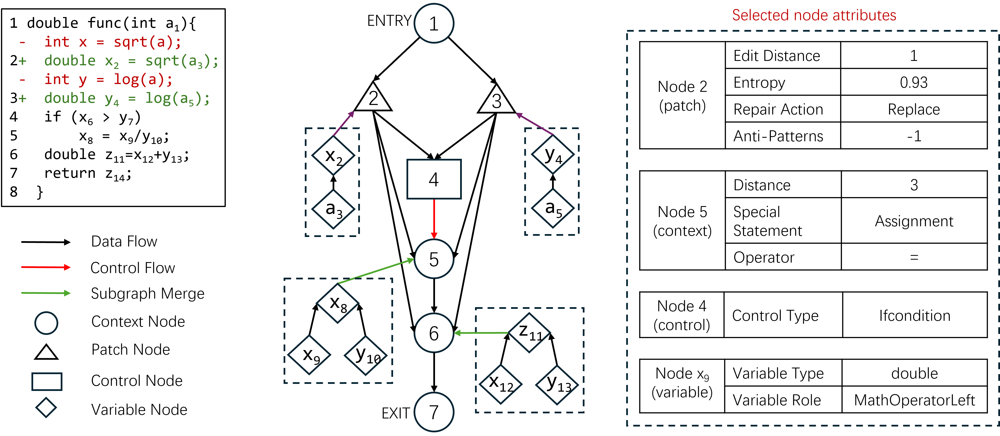
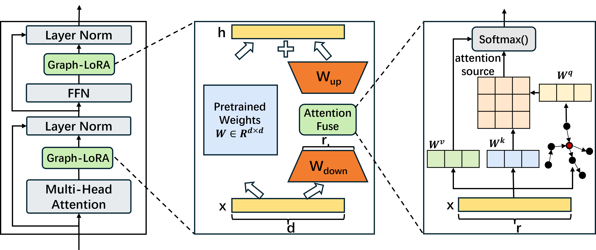

# Graph-LoRA
A PyTorch Implementation of ISSTA‘25 Submission’ "Parameter-Efficient Fine-Tuning with Attributed Patch Semantic Graph for Automated Patch Correctness Assessment". 
## Introduction
Automatic program repair (APR) aims to automatically repair program errors without human intervention, and recent years have witnessed a growing research interest on this research topic. While much progress has been made and techniques originating from different disciplines have been proposed, APR techniques generally suffer from the patch overfitting issue, i.e., the generated patches are not genuinely correct despite they pass the employed tests. To alleviate this issue which overshadows the APR area, many research efforts have been devoted for automated patch correctness assessment (APCA). In particular, with the emergence of large language model (LLM) technology, many researchers have employed LLM to extract patch features and further assess the patch correctness. However, existing LLM-based methods typically treat code as token sequences and ignore the inherent formal structure for code, making it difficult to capture the deep patch semantics. To overcome the drawbacks, we in this paper design a novel patch graph representation named attributed patch semantic graph (APSG), which adequately captures the patch semantic and certain important, explicit patch attributes. For effectively using graph information in APSG, we accordingly propose a new parameter-efficient fine-tuning method of large language models named Graph-LoRA.

## Folder Structure
Our code is written based on the Peft package. Here we only describe the files related to the implementation of our model. If you want to know about other files, please refer to Peft's project[https://github.com/huggingface/peft]
```
 ├── Dataset: data used to train and test
 ├── APSG: the code of APSG
     ├──APSG/semanticmodel: the code of generating semantic graphs
     ├──parser: the code of generating node attentions
 ├── peft: the code of peft
     ├──peft/tuners/lora/layer.py: the code of Graph-LoRA
     ├──peft/tuners/lora/attention.py: the code of attention
     ├──peft/tuners/lora/graph.py: the code of getting APSG features
 ├── train.py: the code of training
 ├── test.py: the code of testing
```
## Requirements
* Conda
  * install conda: [https://conda.io/projects/conda/en/latest/user-guide/install/index.html](https://conda.io/projects/conda/en/latest/user-guide/install/index.html)
  * Create a new conda environment:
      * if you are running with GPU: 
        ```
        conda env create -f environment-gpu.yml
        conda activate graphlora
        ```
        Dependencies include support for CUDA_11.4. If you are using a different CUDA version update the dependencies accordingly.
      * if you are running with CPU:   
        ```
        conda env create -f environment-cpu.yml
        conda activate graphlora
## Dataset
      * Wang data can be obtained from：[https://zenodo.org/record/3730599/files/Patches_for_Static.zip]
      * Lin data can be obtained from：[https://github.com/Ringbo/Cache/tree/master/patches/Small]
      * Balance data can be obtained from：[https://github.com/claudeyj/patch_correctness/tree/master/balanced_dataset]
## Dependency
* Python >= 3.8
* Pytorch >= 1.5.0
* Transformers>=4.10.0
* Deepspeed
* Numpy
* Scikit-learn
## Main code introduction
To allow readers to read the code of our model more accurately, we briefly introduce the code corresponding to each module.

The Graph-LoRA model mainly consists of three modules: (1)Graph, (2)Attention, and (3)Graph-LoRA.
* (1) Graph: this module will get APSG features. Implemented in the GCNWithSubgraphs class in the peft/tuners/lora/graph.py file.
* (2) Attention: this module will fuse APSG features and text features. Implemented in the MultiHeadAttention class in the peft/tuners/lora/attention.py file
* (3) Graph-LoRA: this module will conduct efficient-parameter tuning for LLM. Implemented in the Linear class in the peft/tuners/lora/layer.py file.
## Preprocess
Preprocessing the APSG is divided into two steps: (1) Obtaining the Semantic Graph of patch, and (2) Adding the node attributes.
### Obtaining the Semantic Graph
```
javac APSG/semanticmodel/Activator.java
python APSG/semanticmodel/graph.py
```
### Adding the Node Attributes
```
bash attribute.sh
```
## Experiment
Our evaluation is performed on an Ubuntu 22.04.5 server equipped with two RTX A6000 GPUs.
### RQ1 (Model Effectiveness)
We train and test our model in a cross-validation manner on three datasets: Wang dataset, Lin dataset, and Balance dataset.
```
python train.py
python test.py
```
### RQ2 （Ablation Study）
In the ablation experiment, three submodules are gradually deleted: (1) Attention, (2) Graph-LoRA, and (3) APSG.
```
├──whole model
  ├──(1)peft/tuners/lora/layer.py line589->result_fuse=graph+result_down
  ├──(2)peft/tuners/lora/layer.py line588-590 -> result=result+lora_B(lora_A(dropout(x)))
  ├──(3)train.py line 16 ->    train_dataset.append({'text': 'Translate English to chinese:\nInput:'+ patch + '\nOutput:'+ result + '</s>'})
```
### RQ3 (Cross-project Effectiveness)
First, generate a cross-project dataset,
```
python cross-project.py
```
Second, train and test the model after specifying the dataset path, 
```
python train.py
python test.py
```
